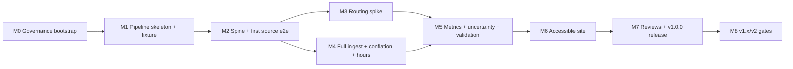

# Milestones, dependencies, risks, effort

Estimates are ranges in **agent sessions** with confidence; totals are
medium-confidence. No calendar promises. Milestones M0–M2 are decomposed into
issue-ready packets (EP-1 … EP-8, one file per packet; EP-4 split into
EP-4a/EP-4b on 2026-09-02). Packet status and the milestone ↔ packet
correlation are tracked in the [README](README.md) tables. M3+ carry a
**mandatory refinement gate** (decompose to packet standard — one session
per packet — before implementation begins).

## Dependency graph



Critical path: M0 → M1 → M2 → M3 → M5 → M6 → M7. M4 parallels M3 (different
toolchains: adapters/parsing vs routing). Within M6, UI shell work can begin
against fixture data once M1's schema contract is stable.

## Milestones

| ID | Outcome (demonstrable increment) | Go/no-go criterion | Packets | Effort (sessions) | Confidence |
|---|---|---|---|---|---|
| M0 | Governed public repo: hygiene, licensing docs, claims matrix, honest reframe (README + repo description), CI skeleton | All M0 packets' acceptance criteria met; repo presentable at any commit | EP-1, EP-2 | 3–4 | high |
| M1 | Pipeline skeleton runs end-to-end on tinycity synthetic fixture: manifest engine, zones, CLI, contract tests | `phillysim run --fixture` green in offline CI | EP-3, EP-4a, EP-4b | 4–6 | high |
| M2 | Thin vertical slice on real data: TIGER/ACS spine + SNAP adapter → tract-joined GeoParquet → trivial public-safe GeoJSON + minimal page | Slice reproducible from fresh clone; license buckets applied | EP-5 … EP-8 | 4–6 | high |
| M3 | Routing spike verdict: r5py benchmarks vs budgets + determinism measured; go = walk+transit within budgets; kill = documented fallback invoked | Numeric criteria (methodology/baseline): wall ≤8 h, process-tree RSS ≤22 GB, determinism within band, sanity gates | [EP-11](EP-11-m3-refinement-gate.md) (the gate, authored by EP-10), then, as EP-11 authored them on 2026-09-03: [EP-12](EP-12-routing-sources.md) (the two routing sources), [EP-13](EP-13-routing-toolchain-harness.md) (toolchain and harness), [EP-14](EP-14-routing-run-matrix.md) (run matrix and the first unattended night), [EP-15](EP-15-routing-verdict.md) (the verdict; the fallback packet only on a kill); pins and decision numbers in [ADR-0008](adr/0008-routing-toolchain-pins.md) | 3 attended (+ unattended runs) | medium |
| M4 | All v1 sources snapshotted, conflated (POI dedup), hours parsed with QA report | Adapter contract tests green; hours-coverage % published; conflation QA reviewed | refinement gate after EP-8 | 5–7 | medium |
| M5 | Metrics + MOE + reliability tiers + sensitivity runs + SRAM like-for-like validation | Golden tests green; validation memo written; method cards drafted | refinement gate (carry-ins below) | 5–7 | medium |
| M6 | Public-safe accessible site: map + parity table + panel + methods/data cards + exports | Playwright+axe green; internal keyboard/NVDA dry run passes | refinement gate | 6–10 | medium (first NVDA loop included) |
| M7 | v1.0.0: harm/claims review, dietitian review (or narrative held out), release checklist, reproducibility rehearsal, tagged release + Pages demo | Full release checklist passes | refinement gate | 3–4 | medium |
| M8 | Evidence-based gate decisions for v1.x/v2 candidates (scope.md) recorded | Each candidate gets promote/hold/kill with rationale | refinement gate | 1–2 | high |

**Total ≈ 34–46 sessions** (+ contingency ≈ 40–50). Sinkhole watch-list:
accessibility parity loops (M6), POI conflation + hours parsing (M4),
routing determinism remediation (M3).

## Spikes & gates

- **M3 routing spike**: run matrix pre-scripted in session 1; long runs
  unattended overnight (excluded from the 3-session box); outcome codes
  KILLED-BY-EVIDENCE vs TIMEBOX-EXHAUSTED (one owner-approved extension
  allowed before fallback). Decomposed by EP-11 (2026-09-03): the sources
  packet EP-12 precedes the box; the box is EP-13 (toolchain, harness,
  smoke route), EP-14 (the matrix as a plan file, rehearsed, then the
  first night), EP-15 (the verdict, which calls the code and authors the
  fallback packet on a kill); the extension is one further attended
  packet plus one night; the numbers each criterion is read against are
  in ADR-0008.
- **PMTiles smoke test**: only if the v1.x basemap enhancement is pursued.
- **Checkpoint packets**: every ~5 packets, a recurring S-sized checkpoint:
  integration re-run on fixtures (+ real spine once it exists), docs/data-
  dictionary sync, license-label sweep, performance vs budgets, estimate-
  accuracy review; re-plan if triggers hit. Tracked in the README's
  "Checkpoints" table; the first is [EP-9](EP-9-checkpoint-1.md), after
  EP-4b (M1 done) and before EP-5; the second is
  [EP-10](EP-10-checkpoint-2.md), after EP-8b (M2 done) and before the M3
  refinement gate, which it authored as its own packet,
  [EP-11](EP-11-m3-refinement-gate.md), on 2026-09-03; the third falls
  due about five packets after EP-10 (with the M3 verdict packet or
  EP-15, whichever comes first) and takes the next free integer.

## Refinement-gate carry-ins

Items that earlier packets deferred to a later milestone's refinement gate.
**Whoever authors that milestone's packet files applies these first**, then
deletes the entry here and records the deletion in the new packet's handoff.
The roadmap README's reading order points here, so no one has to remember.

### M4 — SNAP retailer follow-ups (deferred by EP-6, 2026-09-02)

Paste into the M4 packet that conflates destination sources (under
"Scope → in" and "Implementation notes"), then delete this entry:

```markdown
- OSM `shop=supermarket` cross-check of the SNAP supermarket-format layer
  (methodology.md "Destination layers"; deferred by EP-6): report agreement
  and disagreement counts in the conflation QA, never reclassify a SNAP
  row from OSM evidence without a methods-version note.
- Two SNAP rows USDA attributes to Philadelphia County but geocodes outside
  every tract (`snap_retailers:873249`, `snap_retailers:903932`; null
  `geoid` in `curated/snap_retailers.parquet`, named in the SNAP data
  card): decide drop / re-geocode / keep, and record it.
- Thirteen pairs of SNAP retailers share identical coordinates; conflation
  must treat them as distinct authorizations unless another source shows
  otherwise.
- USDA's own `Farmers' Market` rows (7 open in the county) overlap the
  City's farmers'-market layer: conflate, do not double count.
```

### M5 — supermarket-format sensitivity (deferred by EP-6, 2026-09-02)

Paste into the M5 sensitivity packet, then delete this entry:

```markdown
- Sensitivity of the supermarket-format results to the class boundary:
  re-run with USDA `Large Grocery Store` (22 open rows in the county at
  2025-12-31) added to `supermarket`; report the difference, do not change
  the published mapping (`store-formats-1`) without a version bump.
- The all-SNAP-retailer variant for the SRAM comparison is the whole
  `curated/snap_retailers.parquet` table (1,609 rows as of 2025-12-31);
  SRAM's vintage and universe must be matched to it explicitly (the
  historical file omits USDA's `Direct Marketing Farmer` and `Internet
  Retailer` types, which SRAM may include).
```

### M5 / M6 — the QA slice column and the public schema (deferred by EP-7, 2026-09-02)

Paste into the first M5 packet that replaces the real `metrics` stage body,
and into the M6 packet that designs the map / table fields; then delete
this entry:

```markdown
- The real `metrics` stage body today is the QA-only slice metric
  `qa_straight_line_m` (`phillysim.metrics.slice`, methods version
  `slice-qa-1`; method card `docs/method-cards/qa-straight-line.md`).
  Replace the body with the transparent baseline family, bump
  `methods_version`, and **keep the `qa_` column** in the analytic table as
  a QA column (never promote it: methodology.md "Travel model"); the publish
  gate enforces the `qa_only` flag and the QA note on any `qa_` column.
- The public zone (public schema version 1, data dictionary "Public zone")
  widens every tract-metric into five columns (`<metric_id>[__<category>]
  [__<mode>]` + `_moe`, `_cv_tier`, `_reliability_action`, `_bin`) and
  records field descriptions and bin edges in `public/manifest.json`. The
  M6 page reads fields from the manifest, never bins on its own, and renders
  `qa_only` fields only under their description or not at all. A change to
  the public files or manifest shape bumps `public_schema_version` (a
  `publish` stage parameter) with a dictionary note.
```

### M5 — routing outputs and the sensitivity runs (deferred by EP-11, 2026-09-03; EP-15 completes it with the verdict)

Paste into the first M5 packet that consumes travel times (and the M5
sensitivity packet for the second and third items), then delete this
entry:

```markdown
- The routing spike's night records (`<data root>/runs/routing/`, EP-14)
  hold the wall time and peak process-tree RSS of every run, including
  the slow-walk (3.0 km/h) and Saturday-window runs, which were timed but
  not judged in M3; size M5's sensitivity runs (slow-walk, threshold grid,
  Saturday market metrics) and its unattended nights from those numbers,
  not from the core runs alone.
- The block-group population-weighted centroid sensitivity (methodology.md
  "Units and origins") multiplies the origin count by roughly three and
  needs a routing night of its own; it was never in the spike.
- On a go verdict EP-15 registered the real `travel_times` stage and
  launched its first run as a second night: confirm that run finished,
  that `curated/travel_times.parquet` is in the dictionary's shape, and
  that its canonicalized-value digest equals the first night's core
  digests (the cross-night determinism repeat), before any metric reads
  it; the third checkpoint's fresh-clone re-run now includes an
  unattended routing stage and must plan for it.
- The all-retailer matrix (408 × 1,609) already exists from the spike;
  the SRAM comparison reads it, and the supermarket-format layer is its
  subset.
- The fixture pipeline's `network` and `travel_times` stubs stay stubs
  (EP-11, question 6); the real bodies are tested by their run records
  and the CI performance smoke measures the fixture stages only.
```

### M5 — reliability conventions (OQ-I; deferred by EP-3, 2026-09-02)

The tinycity fixture and `phillysim.contracts.ANALYTIC_TABLE` encode four
conventions that methodology.md does not fully fix. They must be confirmed or
revised before the first published metric exists.

1. **When authoring the first M5 packet that computes a published
   `estimate` / `moe`**, paste this under its "Prerequisites & locked
   decisions" → `locked decisions honored:` line, verbatim:

   ```markdown
   - locked decisions honored: OQ-I resolved in this packet — confirm or
     revise the four reliability conventions (CV = (MOE / 1.645) / estimate;
     tier edges 12 % / 40 % with tier 1 below 12 %, tier 2 to below 40 %,
     tier 3 at or above; `reliability_action = interval-only` iff tier 3;
     `moe` / `cv_tier` null for quantities without sampling error) against
     the ACS handbook chapter on derived estimates and methodology.md
     "Uncertainty"; record the outcome in `docs/data-dictionary.md`
     (analytic-table section) and close OQ-I in `roadmap/open-questions.md`.
   ```

2. **Baseline check when deciding.** Boundary inclusivity and the null
   convention are clarifications; no baseline change. A different
   `reliability_action` rule stays inside the baseline's
   `{none, interval-only}` set and is a `methods_version` bump only. Only a
   change to the 12 % / 40 % edges themselves touches the frozen baseline
   and needs a new baseline version plus impact analysis.

3. **Apply in one packet.** The convention lives in four places, all under
   `phillysim/`: `cv_tier()` and `reliability_action()` in
   `src/phillysim/fixtures/tinycity.py`; `ANALYTIC_TABLE` in
   `src/phillysim/contracts.py`; `METHODS_VERSION` in the fixture module
   (bump it on any change); the analytic-table section of
   `docs/data-dictionary.md`. Then regenerate both fixture variants
   (`phillysim gen-tinycity --out tests/fixtures/tinycity` and
   `… --out tests/fixtures/tinycity-invalid --variant invalid`) and run
   `uv run pytest`.

4. **Regression guard.** `test_cv_tier_rule` and
   `test_expected_tables_are_internally_consistent` in
   `phillysim/tests/test_tinycity_fixture.py` pin the formula and the
   tier-to-action mapping. Update their expected values in the same commit
   as the convention change, never separately, so any later drift fails CI.

## Estimate accuracy

Kept by the checkpoint packets (first entry EP-9, 2026-09-02; every later
checkpoint appends). "Actual" is sessions to the handoff commit, from the
packet handoffs; the ratio is actual ÷ estimate midpoint.

| Packet | Estimate (sessions) | Actual | Ratio | Note |
|---|---|---|---|---|
| EP-1 | S, 1 | 1 | 1.0 | Documentation only (2026-08-23) |
| EP-2 | M, 1–2 | 1 | 0.67 | Scaffold + CI; first packet under the interactive owner-review rule |
| EP-3 | M, 1–2 | 1 | 0.67 | Generator, contracts, 52 tests |
| EP-4a | S, 1 (split from the L packet EP-4 at pickup) | 1 | 1.0 | Plus a one-line Linux CI fix in the same session |
| EP-4b | S, 1 (the other half of EP-4) | 1 | 1.0 | M1 go/no-go met |
| M0 | 3–4 | 2 | 0.57 | Both packets one session each |
| M1 | 4–6 | 3 | 0.60 | Both halves of the split L packet one session each |
| EP-9 | S, 1 | 1 | 1.0 | Checkpoint 1 (2026-09-02); belongs to no milestone |
| EP-5a | S, 1 (split from the M packet EP-5 by the EP-9 pre-read) | 1 | 1.0 | First real acquisition through the guarded path; network, three providers |
| EP-5b | S, 1 (the other half of EP-5) | 1 | 1.0 | Curated spine, invariants, ADR-0007 |
| EP-6 | M, 1–2 (read at pickup: fit one session, not split) | 1 | 0.67 | First destination source; a 24 MB nationwide file; the mapping and its method card |
| EP-7 | M, 1–2 (read at pickup: fit one session, not split) | 1 | 0.67 | The publication boundary: bucket derivation, gate, bins, escaping |
| EP-8a | S, 1 (split from the M packet EP-8 at pickup) | 1 | 1.0 | First browser page; Playwright + axe on both CI platforms |
| EP-8b | S, 1 (the other half of EP-8) | 1 | 1.0 | Fifth source, public schema 2, measured contrast; M2 go/no-go met |
| M2 | 4–6 (four M packets as authored, 4–8) | 6 | 1.20 | Every packet one session; the two split M packets took two sessions each, the two unsplit ones one each |

**What this implies (EP-10, 2026-09-03).** Twelve of twelve packets have
landed in one session each, which is now true by construction (the sizing
rule and the pickup pre-read make a packet one session or split it before
work starts), so the packet-level ratio no longer carries information; the
milestone ranges do. The real-data actuals EP-9 said were missing are in:
M2, the first milestone with network acquisition (five providers, 123 MB),
real geometry, a browser page, and CI on two platforms, came in at **6 of
4–6**, its high bound, where M0 and M1 came in under their low bounds. The
reason is visible in the rows: the four M packets as authored (4–8
sessions) resolved to two sessions each where the pre-read split them
(EP-5, EP-8) and one each where it did not (EP-6, EP-7), a mean of 1.5,
the M midpoint; none came in under a session. Real data, the network, and
the browser did not blow any packet, but they used the whole session every
time. For M3–M8 the reading is: the milestone ranges still contain the
actual, and the high bound, not the low one, is the planning number from
here on; the refinement gate's decomposition count (the number of S
packets it authors) is a better estimate than the range and replaces it at
the next checkpoint. The M3 attended estimate (3 sessions plus unattended
runs) is the first to be tested against that rule: EP-11 records the
count it authors. Re-sizing was proposed to the owner at EP-10: keep the
M3–M8 ranges as written and plan against their high bounds (M3–M8 at the
high bound is 33 sessions, total about 44 of the 34–46 baseline, inside
the 40–50 contingency), or raise the two sinkhole-watch milestones now
(M4 5–7 → 6–8, M6 6–10 → 8–12, total 39–51). **Owner decision
(2026-09-03): the first.** The table is unchanged; the high bound is the
planning number from here on, and each gate's packet count replaces its
milestone's range at the checkpoint that follows it. **EP-11's count
(2026-09-03):** four S packets after the gate (EP-12 to EP-15), of which
three (EP-13 to EP-15) are the attended spike box and one (EP-12, the two
source adapters) is ingest work the spike needs; against the "3 attended"
estimate that is 4 attended sessions plus the gate, and the checkpoint
after EP-15 records the actual.

**Re-plan trigger evaluation (EP-10, 2026-09-03).** (1) Kill criterion
fired: none exists before the M3 spike; not fired. (2) Checkpoint finds
drift: the fresh-clone re-run was green, fixture and real (461 tests; 11
ran, then 11 skipped; 8 ran, then 8 skipped, with a fresh acquisition of
the five providers), every provider data file, curated table, and public
file byte-identical to the recorded references (no refresh drift); the
license sweep found no contradiction; five documentation statements had
fallen behind the code (the test matrix's source and stage counts, the
architecture stage table's `acquire` row, the DATA-LICENSES labeling
status, the dictionary's contract note, the root README's dictionary line)
and were fixed in the packet; no code contradicted a document; not fired.
(3) Two consecutive packets over estimate by more than 2×: no packet has
exceeded its estimate; not fired.

**Re-plan trigger evaluation (EP-9, 2026-09-02).** (1) Kill criterion
fired: none exists before the M3 spike; not fired. (2) Checkpoint finds
drift: the fresh-clone re-run was green (240 tests; 11 ran, then 11
skipped; 11 fresh; 8 of 8 snapshots and 11 of 11 stages verified); two
documentation statements contradicted the code (the root README's "no
pipeline logic exists yet" and the fixture README's description of `verify
--fixture`) and were fixed in the packet; no code contradicted a document;
not fired. (3) Two consecutive packets over estimate by more than 2×: no
packet has exceeded its estimate; not fired.

**What EP-9 implied (2026-09-02, superseded above).** Five of five
packets, including both M-sized ones, landed in one session, and both
milestones came in under their low bound; the M2 packets were not re-sized
because they were the first with real data, network acquisition, and a
browser page, and the next checkpoint was to re-evaluate with those
actuals.

## Risks & contingencies

| Risk | Likelihood | Contingency |
|---|---|---|
| Routing spike kill | low-med | Walk-only v1 (partial fallback allowed); transit becomes v1.x |
| R5 nondeterminism breaks checksum claim | med | Pinned seeds / documented variance band; wording already scoped (AM-2) |
| Market hours unparseable at acceptable coverage | med | Tier 2 published for meal sites only; markets Tier 1 + disclosed gap |
| City license position challenged | very low (Open Data Program office confirmed open reuse in writing, 2026-09-02, OQ-A) | Takedown-ready; reply archived with the terms records; method+script publishing model preserves the work |
| SEPTA terms change | low | Walk-only fallback; facts-not-contents position documented |
| a11y gate rework loops | med | Cutline (scope.md) + parity checklist early in M6, not at the end |
| Upstream URL churn | high | Dual-URL manifests + terms archiving (standing policy) |
| Solo-maintainer stall | med | Every milestone ends coherent/tested; archival path defined (governance.md) |

## Session model

One packet per session, and packets are sized to make that true: every
packet authored from 2026-09-02 on is S (one session), and a pre-rule M
packet that will not fit is split at pickup into lettered parts before work
starts (README "Packet sizing and splitting"). Session ends tests-green,
committed, pushed, with the handoff payload (_TEMPLATE.md) and the packet's
row in the README tables updated. Trunk-based; short-lived branches for
risky packets; ADR for hard-to-reverse choices. Blocked → record blocker in
the packet, stop at a coherent state, surface to owner. Re-plan triggers:
any kill criterion fires; checkpoint packet finds drift; two consecutive
packets blow their estimate by >2×.
