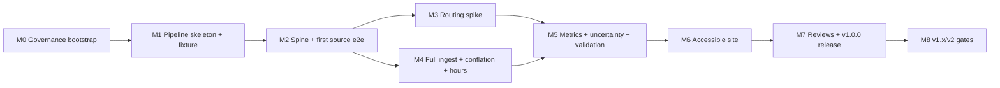

# Milestones, dependencies, risks, effort

Estimates are ranges in **agent sessions** with confidence; totals are
medium-confidence. No calendar promises. Milestones M0–M2 are decomposed into
issue-ready packets (EP-1 … EP-8, one file per packet); M3+ carry a **mandatory refinement gate**
(decompose to packet standard before implementation begins).

## Dependency graph

Critical path: M0 → M1 → M2 → M3 → M5 → M6 → M7. M4 parallels M3 (different
toolchains: adapters/parsing vs routing). Within M6, UI shell work can begin
against fixture data once M1's schema contract is stable.

## Milestones

| ID | Outcome (demonstrable increment) | Go/no-go criterion | Effort (sessions) | Confidence |
|---|---|---|---|---|
| M0 | Governed public repo: hygiene, licensing docs, claims matrix, honest reframe (README + repo description), CI skeleton | All M0 packets' acceptance criteria met; repo presentable at any commit | 3–4 | high |
| M1 | Pipeline skeleton runs end-to-end on tinycity synthetic fixture: manifest engine, zones, CLI, contract tests | `phillysim run --fixture` green in offline CI | 4–6 | high |
| M2 | Thin vertical slice on real data: TIGER/ACS spine + SNAP adapter → tract-joined GeoParquet → trivial public-safe GeoJSON + minimal page | Slice reproducible from fresh clone; license buckets applied | 4–6 | high |
| M3 | Routing spike verdict: r5py benchmarks vs budgets + determinism measured; go = walk+transit within budgets; kill = documented fallback invoked | Numeric criteria (methodology/baseline): wall ≤8 h, process-tree RSS ≤22 GB, determinism within band, sanity gates | 3 attended (+ unattended runs) | medium |
| M4 | All v1 sources snapshotted, conflated (POI dedup), hours parsed with QA report | Adapter contract tests green; hours-coverage % published; conflation QA reviewed | 5–7 | medium |
| M5 | Metrics + MOE + reliability tiers + sensitivity runs + SRAM like-for-like validation | Golden tests green; validation memo written; method cards drafted | 5–7 | medium |
| M6 | Public-safe accessible site: map + parity table + panel + methods/data cards + exports | Playwright+axe green; internal keyboard/NVDA dry run passes | 6–10 | medium (first NVDA loop included) |
| M7 | v1.0.0: harm/claims review, dietitian review (or narrative held out), release checklist, reproducibility rehearsal, tagged release + Pages demo | Full release checklist passes | 3–4 | medium |
| M8 | Evidence-based gate decisions for v1.x/v2 candidates (scope.md) recorded | Each candidate gets promote/hold/kill with rationale | 1–2 | high |

**Total ≈ 34–46 sessions** (+ contingency ≈ 40–50). Sinkhole watch-list:
accessibility parity loops (M6), POI conflation + hours parsing (M4),
routing determinism remediation (M3).

## Spikes & gates

- **M3 routing spike**: run matrix pre-scripted in session 1; long runs
  unattended overnight (excluded from the 3-session box); outcome codes
  KILLED-BY-EVIDENCE vs TIMEBOX-EXHAUSTED (one owner-approved extension
  allowed before fallback).
- **PMTiles smoke test**: only if the v1.x basemap enhancement is pursued.
- **Checkpoint packets**: every ~5 packets, a recurring S-sized checkpoint:
  integration re-run on fixtures (+ real spine once it exists), docs/data-
  dictionary sync, license-label sweep, performance vs budgets, estimate-
  accuracy review; re-plan if triggers hit.

## Risks & contingencies

| Risk | Likelihood | Contingency |
|---|---|---|
| Routing spike kill | low-med | Walk-only v1 (partial fallback allowed); transit becomes v1.x |
| R5 nondeterminism breaks checksum claim | med | Pinned seeds / documented variance band; wording already scoped (AM-2) |
| Market hours unparseable at acceptable coverage | med | Tier 2 published for meal sites only; markets Tier 1 + disclosed gap |
| City license position challenged | low | Takedown-ready; ODP confirmation request in progress; method+script publishing model preserves the work |
| SEPTA terms change | low | Walk-only fallback; facts-not-contents position documented |
| a11y gate rework loops | med | Cutline (scope.md) + parity checklist early in M6, not at the end |
| Upstream URL churn | high | Dual-URL manifests + terms archiving (standing policy) |
| Solo-maintainer stall | med | Every milestone ends coherent/tested; archival path defined (governance.md) |

## Session model

One packet per session; session ends tests-green, committed, pushed, with the
handoff payload (_TEMPLATE.md). Trunk-based; short-lived branches for
risky packets; ADR for hard-to-reverse choices. Blocked → record blocker in
the packet, stop at a coherent state, surface to owner. Re-plan triggers:
any kill criterion fires; checkpoint packet finds drift; two consecutive
packets blow their estimate by >2×.
